  

<b>I turn everyday workflows into useful software.</b> Interfaces that make sense. APIs that connect them. Data that stays organized.

### Behind the build

I'm **Bernstain O. Fangon**, a BSIT student building across the full stack. My projects focus on scheduling, resource management, and systems that help people get their work done.

- **Frontend:** React, TypeScript, Tailwind CSS, HTML, and CSS.
- **Backend:** Node.js, Express, PHP, and Python.
- **Data:** PostgreSQL, Supabase, MySQL, and SQLite.
- **Practice:** readable code, input validation, role-based access, and useful interfaces.

### One idea. Every layer.

| Interface | Application | Data |
| --- | --- | --- |
| Design screens around the user's task | Connect workflows through APIs and business logic | Model records and protect data integrity |
| React · TypeScript · Tailwind CSS | Node.js · Express · PHP | PostgreSQL · Supabase · MySQL |

### Projects with a purpose

| Project | What I'm building |
| --- | --- |
| [OptimaSched](https://github.com/fangonbernstain566-collab/OptimaSched) | A scheduling system focused on classes, rooms, faculty, and scheduling conflicts. |
| Aringay Agriculture | A farmer and resource management system spanning administration, distributions, and farmer workflows. |
| Student systems | Registration and record management projects that bring classroom concepts into practical applications. |

### Build telemetry

  

Public GitHub data, refreshed by this repository's workflow. These counts describe repository activity; they are not a measure of skill.

---

<b>Understand the problem. Build the layers. Refine the experience.</b>

